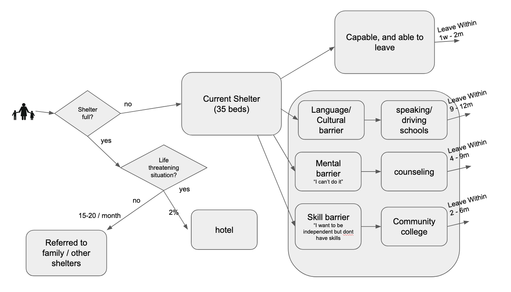

# Shelter Simulation Using Simpy
The objective of this project is to "learn by doing". We attempt to simulate an abused women shelter using Python's simpy library.


## Simulation Problem (non-profit women's shelter)

The non-profit women's foundation we volunteer with provides services for abused women in North Texas. One of the services is to provide a safe shelter for the women and their families.
The foundation is now at capacity with their shelter. It is actively seeking to apply for a loan create another shelter. The cost of the new shelter is directly proportional to the number of beds. Therefore, it has to determine, and explain in the business case, the optimum number of beds to cater for the growing needs.

This model attempts to simulate the current scenario and simulate the distribution of families this organization has to turn away because of current capacity constraints.

### Workflow Diagram




### Workflow details

- An abused women's shelter has to take in women and often their young children to protect them from the abuser. 
- Several times, there are more clients than the beds at a shelter place, and that is when this women's shelter has to either talk to the victim's other family members to take them, or if the issue is life threatening, take them into a private undisclosed hotel.
- In the pandemic the foundation had to refer 30-40 clients/months clients because of capacity problems
- Over the last 6 months, the number has dropped to 15-20 clients.


#### How to model the outflow from the shelter. 


The shelter does not force any of its client out ever, so the outflow is completely variable and needs to be modeled as well. The clients successfully leave the shelter in 4 scenarios:

1. **CASE 1: (CAPABLE) Capable and quickly back on their feet:** These women have occupational skills, know the culture, the english language, and are mobile. They just need a short respite at the shelter until they collect themselves and they are back on their feet quickly.
- Stay at shelter: These women generally leave the shelter betweem 1 week to 2 months.

2. **CASE 2: (CULTURAL) Language and cultural barrier:** Some women may not even know how to speak proper english, or read or write english. They may also not know how to drive. In these circumstances, the organization provides opportunities for driving and other basic language training to get these women to start becoming self-sufficient. 
- Stay at shelter: These women and their families may have the longest stay in the shelter, ranging from 9-12 months.

3. **CASE 3: (MENTAL) Mental barrier:** Some women are not self-confident to take on providing for their families, as they may have never done it, or not done it for a long time. For them, this organization provides counseling and coaching services to build up their confidence. Along with such services, other vocational training opportunities are also provided to these women.
- Stay at shelter: These women are not starting from the cohort in Group 2, but still have a considerable journey ahead of them to become self-confident and then self-sufficient, They can end up staying at the shelter for 4-6 months but for some, the stay can also a long tail approach 9months.

4. **CASE 4: (SKILLS) Skills barrier:** These women want to be on their own, and have the motivation and desire. However they may not have the required skillset to provide for their families. The women's shelter provides funds for vocational education and options associated with the community colleges to help such women. (this may always not be a viable option depending on the circumstances of the client)
- Stay at shelter: These women are typically back on their feet independently between 2-6 months.


#### Code 

All the code was written in jupyter notebooks. The progression of sophistication of the model  can be seen  from v1 to v8 of the notebooks in this [directory](https://github.com/sim-team-z/learning-simpy/tree/main/notebooks)

- The final notebook for the submission of the project is [here](https://github.com/sim-team-z/learning-simpy/blob/main/notebooks/FINAL_08_shelter-model.ipynb)
- The tabular output of the data is [here](https://github.com/sim-team-z/learning-simpy/tree/main/notebooks)


### todo list:

Maintained [here](https://docs.google.com/spreadsheets/d/1JxEUYGeIJr_GaAnwlvuwT7JyXx9fI1BQMFuis9mdcBY/edit#gid=0)


### Future Plans:

- further data analysis:
	- we need to identify the impact of increasing shelter beds to monthly "returned clients" (it should be dropping), and to available capacity ("it should be increasing")
	- the sweet spot # of beds will be when we are returning zero (or a tolerable number of) clients, while not having an excessive capacity.
		- (short term) model the test_run_new.csv data into the excel sheet [here](https://github.com/sim-team-z/learning-simpy/blob/main/notebooks/misc/xlsx-pivots-datasummary-test_run_new.xlsx) to run pivots on the data to see monthly trends.
		- long term the analysis needs to be incporporated as part of the model (as its very tricky doing the delta math in excel for multi year runs)
- reverse engineer the real-world parameters.
	- essentially, we need to tune parameters (like arrival rates, or stay durations etc) so that the steady state (year3) results mimic real-world numbers of 15/20 clients turned away.
	- when we accomplish this sweet spot, we know we have tuned our parameters correctly. 
- run sensitivity analysis 
	- we now lock the reverse-engineered parameters 
	- run the model using (15-75 beds) to find optimum # of beds which is not turning away clients and also not underutilized.
- model stay duration for mental impacted patients based on beta distribution
- use advanced NHPP code (bottom of final v8 jupyter notebook) to model incoming client arrivals

### other notes:

- these events are happening over days of year (so thats a decent granularity/time horizone)
- there are other costs, like travel (Uber), food etc which also are related to whether the woman lives at a shelter or at a hotel room. We are considering those out of scope.
- they are also exploring rented apartments as an option for another location, but is also out of scope.


### running jupyter notebooks locally

1. git clone this repo, and cd into the `learning-simpy`directory

2. create a virtual environment 

```
knail1s-MBP.home [learning-simpy]$
knail1s-MBP.home [learning-simpy]$ python3.7 -m venv venv
```

3. activate the venv

```
knail1s-MBP.home [learning-simpy]$ . venv/bin/activate
(venv) knail1s-MBP.home [learning-simpy]$
```

4. install the requirements for the venv
```
(venv) knail1s-MBP.home[learning-simpy]$ pip install -r requirements.txt
```

4. start jupyter notebook, go into the notebooks/ directory and open any of the notebooks there.

```
[learning-simpy]$ jupyter notebook
```


for using the extra notebook modules installed check out:

- Turbocharing jupyter [notebooks](https://towardsdatascience.com/supercharging-jupyter-notebooks-e22f5ad7ca18)